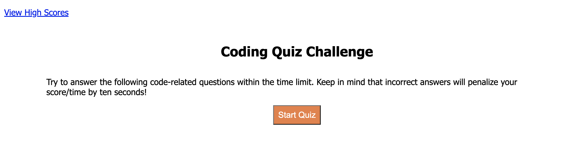
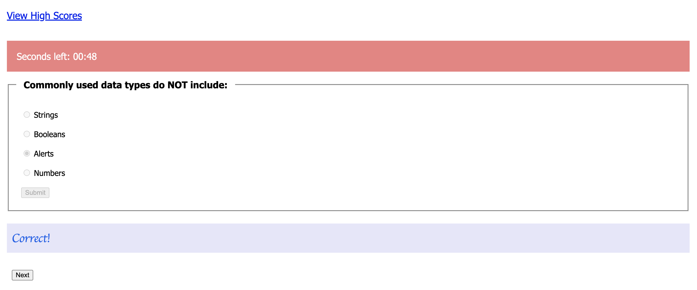

# Timed Code Quiz

## About

This webpage is a small coding quiz that is timed once you hit the "Start Quiz" button. 
As you answer the questions by selecting one of the radio buttons, you will see if you answered it correctly or incorrectly. You can go through the quiz with the "Next" buttons which will take you to more questions and, eventually, to the final pages. But, hurry! You only have 60 seconds to answer all the questions or the quiz will end. 
If you reach the end successfully, you can put in your initals so you can see your scores. Each time you take the quiz, your initials and scores will continue to be added to the high scores list. 

Good Luck!

## Deployed application link

[Timed Coding Quiz](https://ashtreid.github.io/coding-quiz/)

## Screenshots of the website
These screenshots showcase a couple of the pages you'll see on the website

